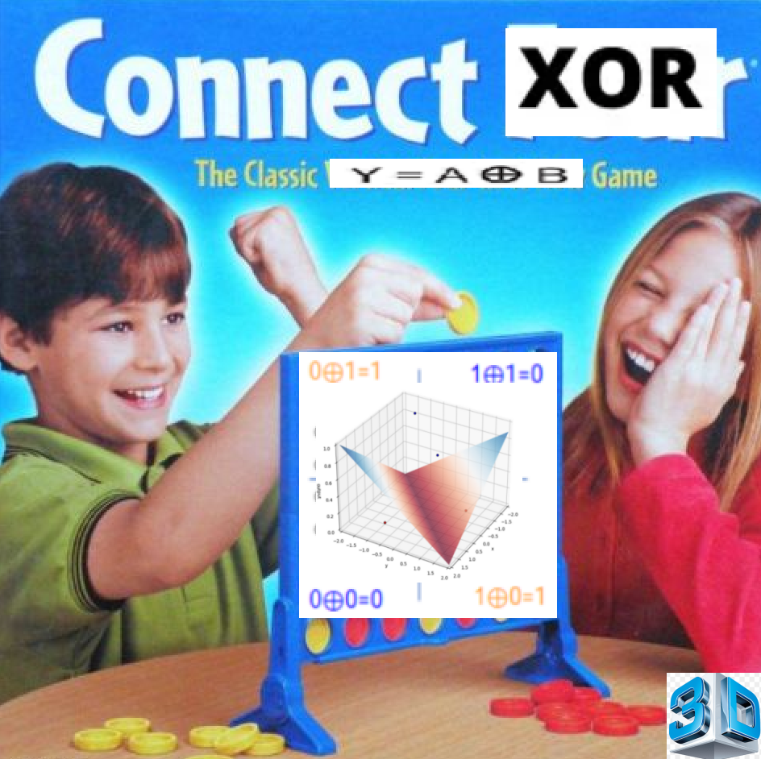

# How to play
Minsky et al. Proved in 1969 that a perceptron cannot solve XOR. All we need is two layers and a bit of creativity (non-linearity) and BAM! Problem solved. 
If our inputs are normalized we also don't need any biases (i just proved this empirically). Well, actually we also need an optimizer, however i'm currently using my GPU for something else, so can you just do this one by hand real quick? Send me the weights by pigeon once you're done, thanks! 

